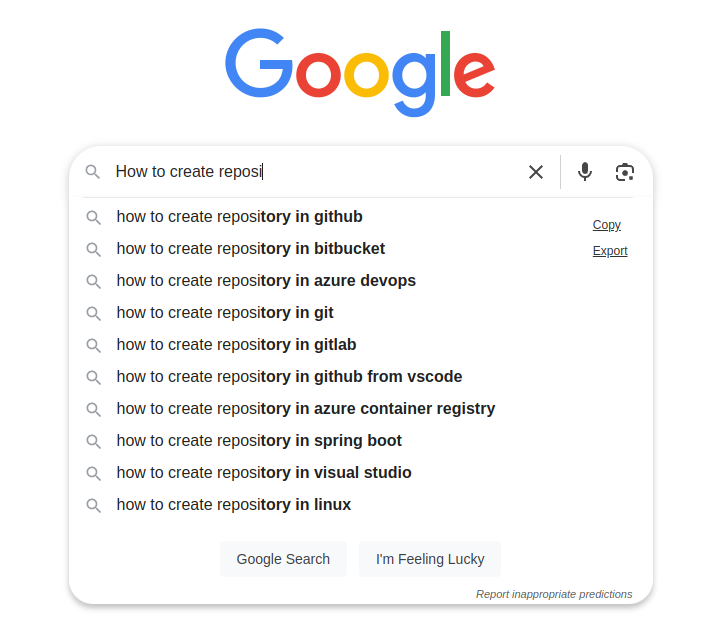
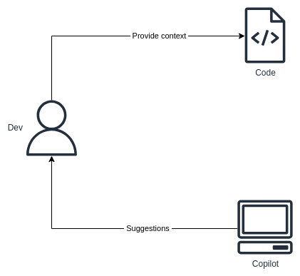

# GitHub Copilot overview <!-- omit in toc -->

## Contents <!-- omit in toc -->

- [1. What is GitHub Copilot?](#1-what-is-github-copilot)
- [2. What can you do with Copilot?](#2-what-can-you-do-with-copilot)
- [3. How does Copilot work?](#3-how-does-copilot-work)
- [4. Limitations](#4-limitations)
- [5. Copilot Interactions](#5-copilot-interactions)
- [6. GitHub CLI](#6-github-cli)
- [7. Example roadmap](#7-example-roadmap)

# 1. What is GitHub Copilot?

- How does it work?
  - 
- Uses an LLM to make predictions.
  - GPT 3.5
  - GPT 4
  - Trained on free code available on GitHub.
- More data for training - better suggestions:
  - Better suggestions for popular languages or frameworks.
  - Not so good suggestions for isolate use cases or unused languages.
- [More details](https://docs.github.com/en/enterprise-cloud@latest/copilot/about-github-copilot/what-is-github-copilot#about-privacy-for-github-copilot-business)
- [Is GitHub Copilot safe to use at work, or should you avoid it](https://nordvpn.com/blog/is-github-copilot-safe-to-use-at-work/)

# 2. What can you do with Copilot?

- Improve your overall productivity.
- Faster code autocomplete.
- Get simple solutions quickly.
- Explain and document code.
- Explain error messages.
- Generate tests.
- Generate boiler plate code.
- And many more.

# 3. How does Copilot work?

- We get a suggestion:
  - Accept it.
  - Reject it.
  - Interate - ask again with more context.

# 4. Limitations

- It's a tool, just like the IDE.
- It can't read our minds, so sometimes we have to provide a lot of context.
- It can't replace experience (knowledge).
- It can't take the responsibility for our code.
- It's a simply a tool.

# 5. Copilot Interactions

1. File comments `#`.
2. Function names.
3. Copilot dialog
   1. VsCode `Ctr + I`
   2. IntelliJ with VsCode Keymap `Ctrl + .`
4. VSCode / IntelliJ right click menu.

# 6. GitHub CLI

- [Github CLI](https://github.com/cli/cli)

# 7. Example roadmap
